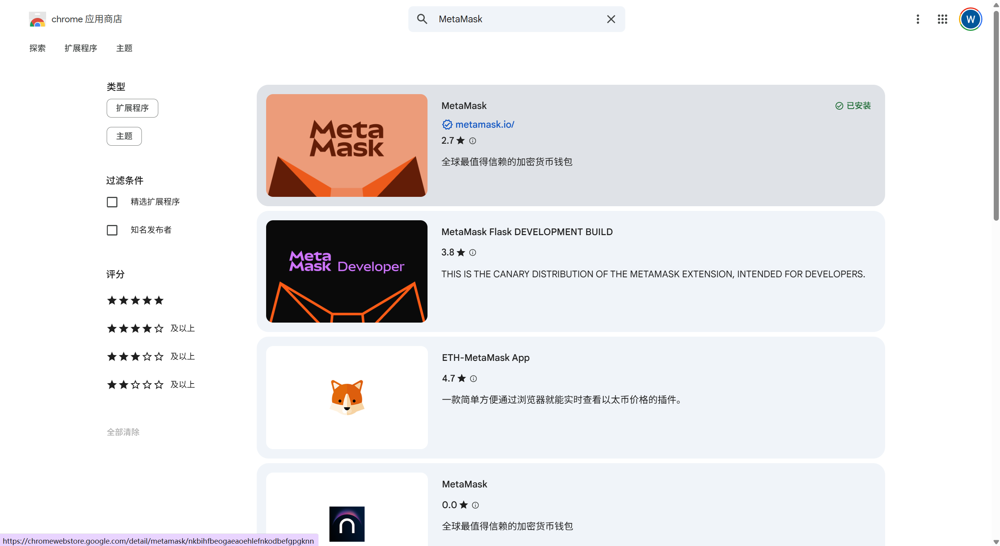
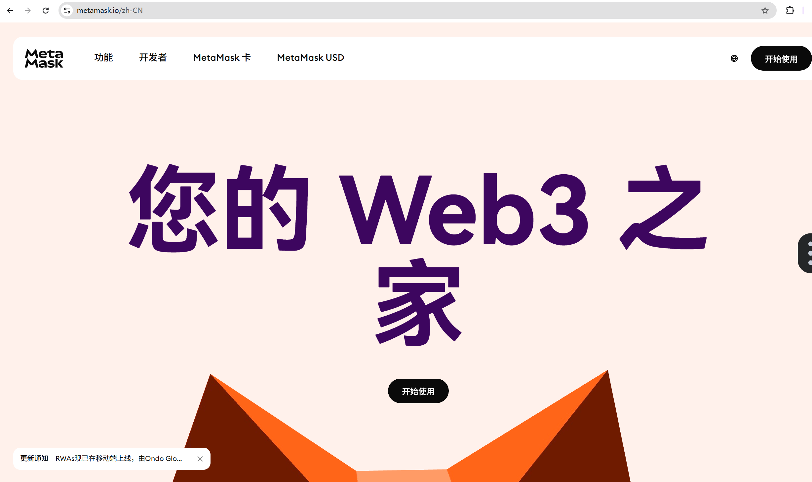
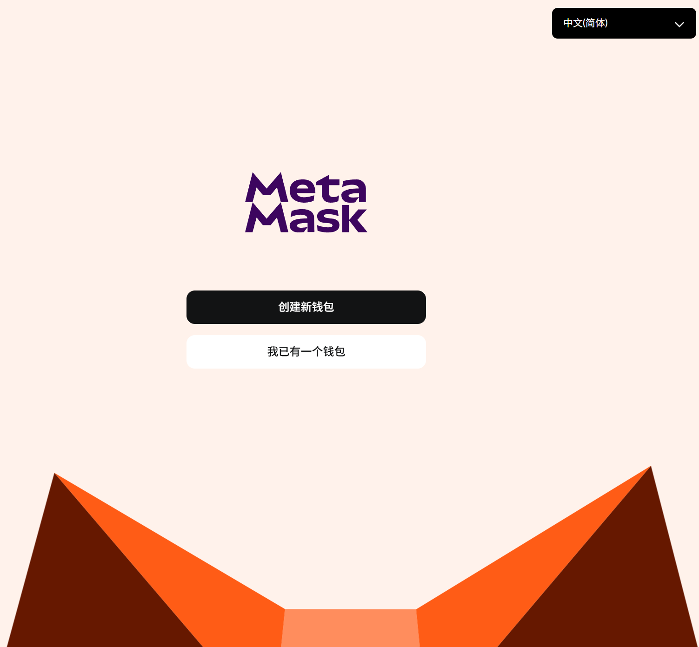
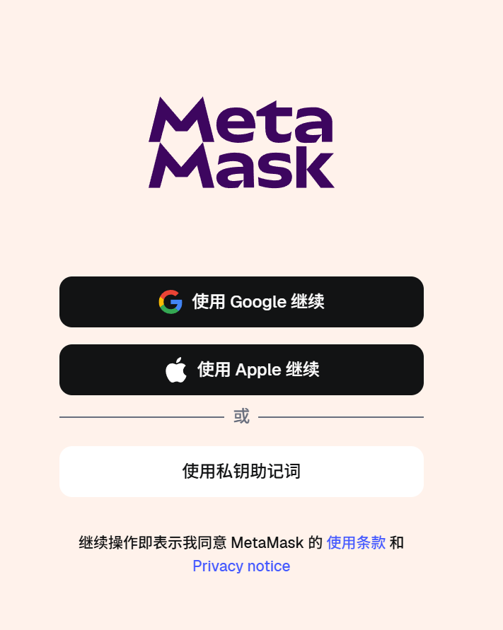
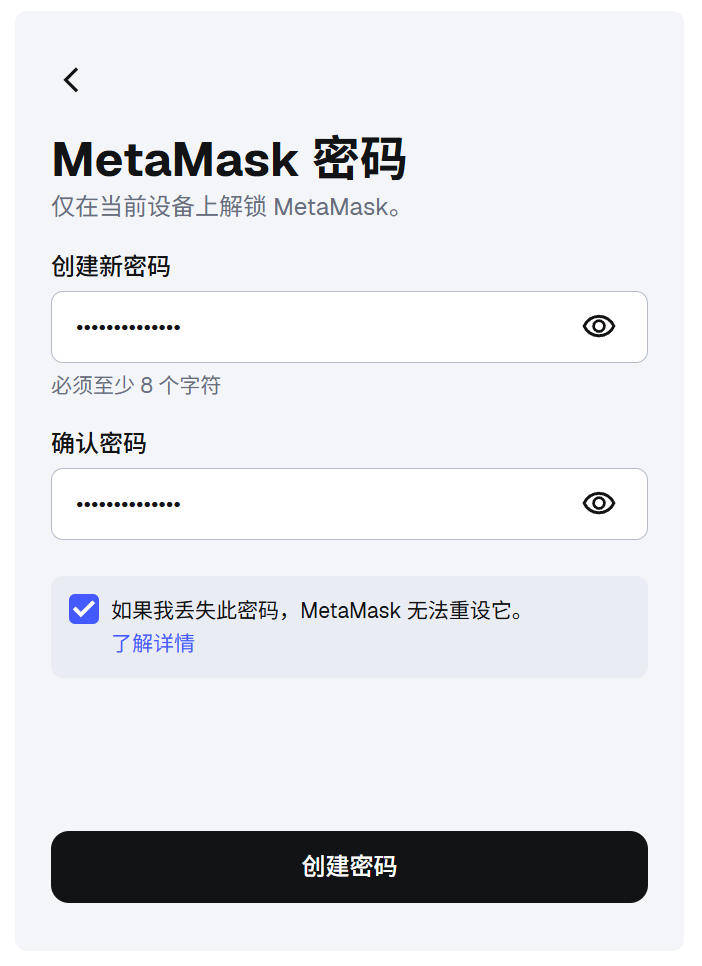
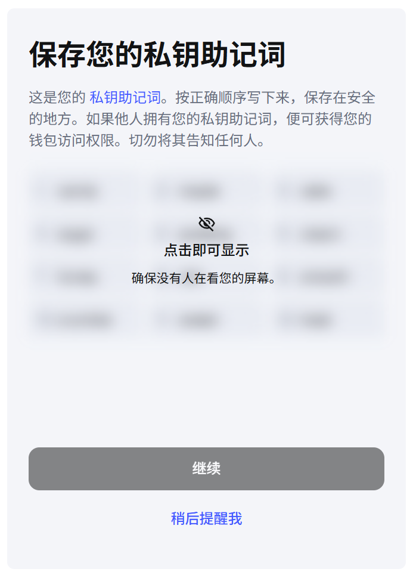
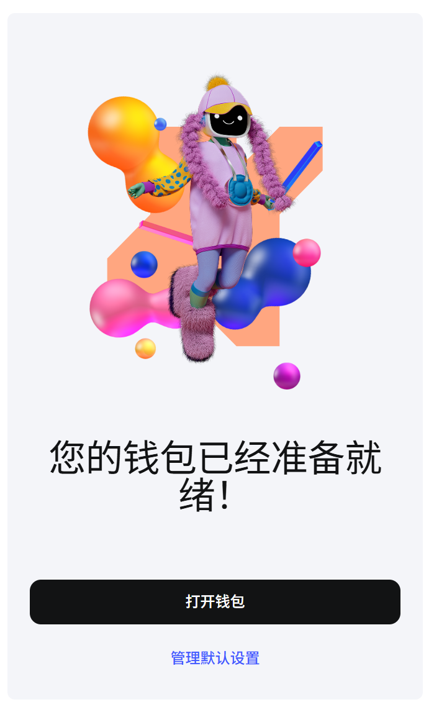
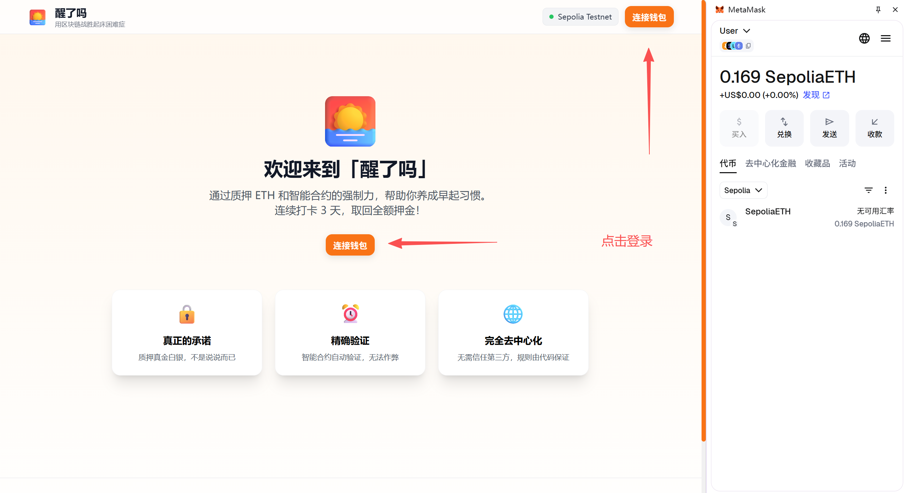
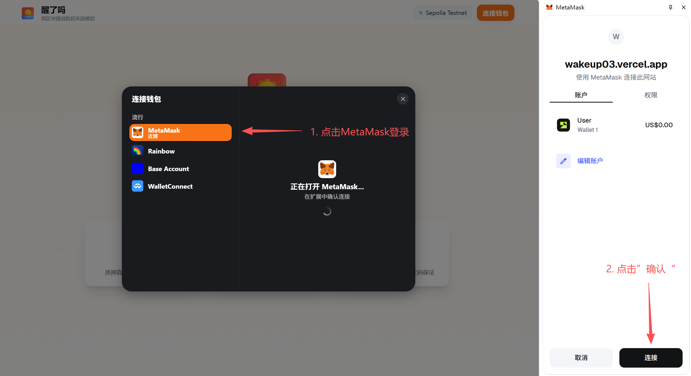

# 小白使用手册

本手册旨在给Web3小白 / Web2使用者介绍链上DApp --  ”醒了吗“的用法。

以Chrome浏览器和MetaMask钱包为例。（手机版可以下载MetaMask App，在app自带的区块浏览器进入网站）

DApp链接：https://wakeup03.vercel.app/

----

## MetaMask钱包注册

1. 进入插件商店，搜索"MetaMask"，安装插件。（认准官方，不要下载到假货）

   
   或者进入官网安装（认准官网地址：https://metamask.io/）
   

2. 点击“创建新钱包”

   

   点击“使用私钥助记词”继续

   

3. 创建密码（此密码记牢，是钱包的登录密码）

   

4. 保存助记词。

         这是一组有序12个单词，是钱包的唯一凭证（和登陆密码不同）。

         你可以凭助记词在其他设备登陆你的本钱包。其他人若拿到了，也可以转走你的钱包里的钱。

         建议离线保存，不要保存在微信、Cloud等在线数据库，有效降低账户被盗的概率。

   

5. 完成

   

## ”醒了吗“连接MetaMask钱包登录

6. 进入网站，点击登录

   

7. 选择MetaMask方式登录

   

8. 登陆成功

**恭喜你！登陆成功，现在可以使用网站了！**

----

记得获取一些Sepolia-ETH测试币，

1. 领取地址1：https://www.alchemy.com/faucets/ethereum-sepolia

   （要求持有0.001以太坊主网ETH）

2. 获取方式2：可以闲鱼几毛钱买到1个Sepolia。